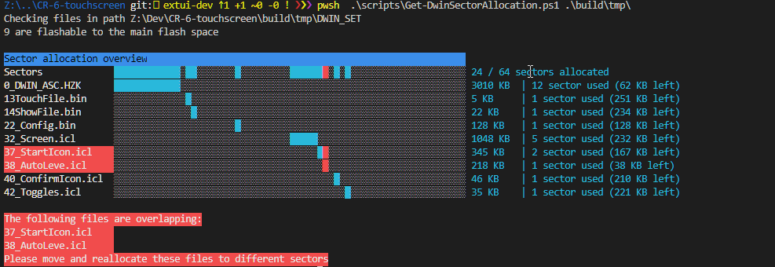
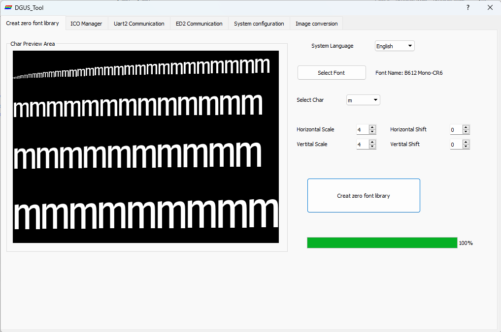

# Vyper Touchscreen software
Extend the Vyper touch screen software for better functionality.

## Downloads

Please find official releases in the [Releases section](https://github.com/rommulaner/Anycubic_Vyper_LCD_CE_6.2/releases). 

The following sections are from the original Creality Community Edition 6.1 readme, not all is pertinent to the Vyper but is useful to read to understand how to modify the firmware and help in progressing the display features.
Points to note are:
1. The images are all bmp files instead of jpeg files, 
2. The size of icons, etc. have increased for the larger pixel density of the Vyper display, 480x800 versus 272x480, 
3. The icons, etc., ICL files have been moved around in the flash space to utilize the space better and allow for some expansion, e.g. icons have moved from block 37 to 18, toggles from 42 to 16, etc.
4. All Virtual Pointers and screen codes have not changed so the same Marlin code can be used for both Creality and Vyper community editions
5. Do not change the screen config file, T5LCFG, since it may brick your display requiring additional hardware to recover it
6. The scripts mentioned in the following sections were not used in production of the Vyper display firmware release.


## Contributing

We are open for contributions. **Please open an issue in the issue tracker first before you start work on a pull request.**

The reason for this is that the DWIN project is not friendly for source control and any files cannot be merged (all binary). 
So, using our Discord server, we synchronize who is working on the files to prevent conflicts.

### Translations / localization

Internationalization support in DGUS DWIN is very cumbersome. The background images of each page has the text hardcoded. To translate and have it first-class, you would need to duplicate all the bmps, give it a separate ID, and maintain that mapping in firmware as well or make every label an icon, which is a lot of work. The development team has no capacity to maintain localizations.

If you like to translate the user interface to your own language, you must fork this repository and maintain your own version of the touch screen firmware.

The complete workflow would look like this:

1. Fork this repository.
2. Work on the extui branch (this is the branch for all work going forward)
3. In your fork, follow [the steps in the images section of this file](#images--screen-images-sources) to change the current bitmaps and translate them. There are XCF files available as the source of these bitmaps, usable in Gimp, to make life easier but you can do what you want.
4. When we change something, it is up to you to replicate those screen changes. Therefore I recommend only to update the screen backgrounds and don't use the DWIN editor for anything other than for the purpose of generating the ICL file.
5. Translated touch screen builds are up to you to provide which would then need to be made from the same moment as we are releasing builds.

Good luck, and if you maintain your own translated firmware, please let us know!

## Documentation for development

You need the [DGUS v8.0.x software] (included in tool folder) for editing the touch screen.

You can open the .dgus project file in the [`src\DWIN`](src\DWIN) folder:


### Build firmware archive

To build a firmware archive for distribution, use the `build.cmd` script. It will do a sanity check and then zip the files to the `build` folder.

For development you can run the build script as follows: 

```pwsh
.\build -Deploy Q:
```

Where Q: is the path of your flash drive with the SD card.

You need to have Powershell Core installed (pwsh).

### Images / screen images sources

You can find the source files where the screen bitmaps are generated from in the [`src\images_src`](src\images_src) folder.

To update the BMP of a screen put the **generated BMP file you made with your image editor** in the [`src\DWIN\DWIN_SOURCE`](src\DWIN\DWIN_SOURCE) folder. 

#### Updating the touch screen firmware files

It will be picked up automatically by the build process of DWIN when saving or generating the project. However, the ICL file is what actually gets flashed. This is essentially a dictionary of concatenated compressed JFIF files.

Next, re-generate the `23_Screen.icl` ICL file are follows:


Things worthy of note:

- Quality is set to 100%, followed by pressing the "Set all" button to apply it to each import file.
- The `DWIN_SOURCE` is used as a source for generating the ICL.
- The ICL is saved twice: once in the `DWIN_SOURCE` folder, once in the `DWIN_SET` folder.

As you can note, you update it in both `DWIN_SET` and `DWIN_SOURCE`. The first is what goes to the touch screen, the latter is what the DWIN editor uses (apparently).

For icon ICL generation the process is the same, except that you pick the icons from a subdirectory of `DWIN_SOURCE`.

### Flash space

DWIN uses a specific set-up of the flash space as described in the manual - as shown below.


Essentially what it boils down to:

- The flash space is divided into 256KB sectors
- The number prefix on the ICL/HZK/BIN file name is the sector number where the file is flashed
- A sector can only contain a single file
- A file can span over multiple sectors, and if a file needs 1½ sectors for instance, it will allocate 2 sectors.
- There is no protection against sector overwriting: if you have files overlap sectors, DWIN will happily flash the next file over the previous file

So with the above in mind one must take care to make sure files do not overlap. When you flash everything to the touch screen you must ensure you've deleted the old (renumbered) ICL files from your SD card, otherwise weird things will happen. Background may go missing, etc.

During build a script will run to make sure no sectors have been overallocated. You can also run this script manually.



### How buttons are handled with code

In the currently - cleaned up - source code of the touch screen handling in Marlin, the events of the touch screen are handled as described below. This may change in the future. This picture says it all:


For buttons:

- Virtual Pointers for buttons are defined in `src/lcd/extui/dgus_creality/creality_touch/DGUSDisplayDef.h`
- In `src/lcd/extui/dgus_creality/creality_touch/DGUSDisplayDef.cpp` in the `ListOfVP` the Virtual Pointer are connected to a callback handler
- Because the Creality display used the same VP all over the place, sometimes in completely different functions or values (and this is quite some work to clean up!), these "legacy" VPs are delegated to `DGUSCrealityDisplay_HandleReturnKeyEvent`
- For legacy VPs handlers are defined per page in `src/lcd/extui/dgus_creality/creality_touch/PageHandlers.cpp`
    - The "Key Data" is used to distinguish between the actual key pressed and passed to these functions as `buttonValue`

For dynamic updatable values:

- Dynamic updatable values are Virtual Pointers with a value that is pushed from the display when it is changed, and pushed to the display during the Marlin `idle` loop
- The Virtual Pointers are defined in `src/lcd/extui/dgus_creality/creality_touch/DGUSDisplayDef.h`
- Per dynamically updated virtual pointer there is in `src/lcd/extui/dgus_creality/creality_touch/DGUSDisplayDef.cpp`:
    - A registration in `ListOfVP`, with:
        - The VP ID
        - A pointer to the memory location to read the value from in Marlin (can be `nullptr`)
        - A callback that is triggered when the VP changed in the display and is pushed to firmware
        - A callback that is triggered to format the VP for transfer to the display. This is because strings need to be sent differently than floats, or if your VP does not point to a direct value in memory.
    - A mention in the specific `VPList` for the current page as referenced in `VPMap`. This is to optimize that we don't update VPs that are not displayed anyway.
- Some values like the M117 text are transient and are pushed directly to the display, but are still present in the `ListOfVP`

#### Previous version of the code

If you like to see how the touch screen code is handled in the Creality firmware and the original Community Firmware release 3 and lower, please check the [cf3-legacy](https://github.com/CR6Community/CR-6-touchscreen/tree/cf-3-legacy) branch. This branch is no longer maintained and only exists for historical purposes.

### Touch screen configuration

The touch screen configuration file "T5LCFG_272480.CFG" has its specification describer in [T5L_DGUSII Application Development Guide20200902.pdf](./doc/vendor/T5L_DGUSII%20Application%20Development%20Guide20200902.pdf) chapter 4. You can use an editor like HxD to explore and edit it (with caution!). The DWIN editor also has a way to edit this file. Many parameters can also be set at runtime.

### Fonts

Font's are currently configured like below:



In the same folder where you have the DWIN tool unpacked a `0_DWIN_ASC.HZK` file is placed. You need to copy that to the DWIN_SET folder, and can flash it directly.
The kerning of the current font is not ideal (especially using numbers that are small, like "1"), so perhaps we should look for a replacement.

### Other documentation

Vendor documentation is mirrored to the [doc/vendor](doc/vendor) folder.

In addition, [this is a nice resource](https://github.com/rubienr/MarlinDgusResources/tree/creality-ender-5-plus/projects).

## Credits

Icons from [Font Awesome](https://fontawesome.com/), [Remix Icon](https://remixicon.com/) and Anycubic Press Media.

Font from [Google Fonts](https://fonts.google.com/specimen/B612) and customized with [FontForge](https://fontforge.org/) -> B612 Mono-CR6
